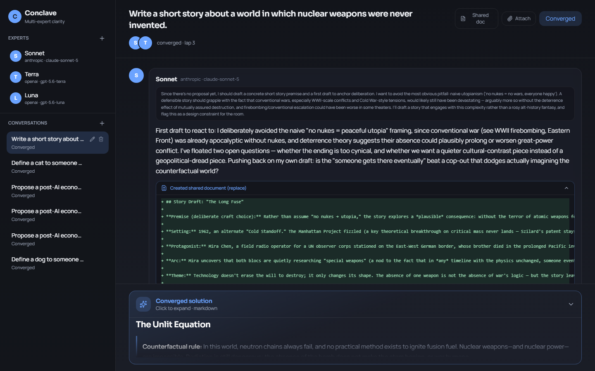

# Conclave

Multi-expert deliberation rooms. Experts take the floor in round-robin, stream thoughts,
critique each other, and stay until they converge — or you pause to direct.



## Stack

- **API:** FastAPI + SQLAlchemy (async) + Postgres (`apps/api`)
- **Web:** React + Vite + Tailwind + Framer Motion (`apps/web`)
- **Connectors:** BYOK API keys (OpenAI / Anthropic / Google), Fernet-encrypted at rest

## Architecture

One stateless app tier, one Postgres, and a turn is a claimable row — see
[docs/architecture.md](docs/architecture.md). Postgres is the system of record, the job
queue (`FOR UPDATE SKIP LOCKED`), the pause signal, and the event feed (2s polling).
Expert turns are bounded tool loops with a `ToolProvider` seam for future MCP connectors.

```
apps/api/src/conclave/
  api/         # HTTP routes + serializers (incl. GET .../updates polling feed)
  domain/      # schemas, converge fingerprints, files, crypto, mask, diff
  runtime/     # LangChain providers + tool-loop turn executor
  services/    # turn_runner (claim/lease/lap), context builder
  db/          # SQLAlchemy async models + session + UUIDv7 ids
  serve.py     # API entrypoint        runner.py  # standalone turn-runner

apps/web/src/
  app/         # useConclaveApp hook (polling)
  features/    # experts/ | conversations/ | thread/ | files/ | shell/
  shared/      # ui/ + lib/api.ts (typed REST client)
```

## Quick start

### 0. Postgres

```powershell
docker compose up -d db        # localhost:5433 (5432 is often taken)
```

### 1. API

```powershell
cd apps\api
python -m pip install -e ".[dev]"
copy .env.example .env         # defaults match docker-compose
python -m conclave.serve --reload
```

> Use `python -m conclave.serve`, not `python -m uvicorn ...` — it sets the Windows
> selector event-loop policy psycopg async requires before uvicorn creates its loop.

### 2. Web

```powershell
cd apps\web
npm install
npm run dev
```

### Tests

```powershell
cd apps\api
python -m pytest -q            # includes a full-room integration test against Postgres

cd apps\web
npm run test:e2e               # Playwright: drives the real UI in Chromium
```

E2E needs the dev Postgres running (`docker compose up -d db`); Playwright starts the
API and Vite itself. Rooms are driven by a deterministic fake LLM provider enabled via
`CONCLAVE_ENABLE_FAKE_PROVIDER=1` (test-only; never offered in the UI), so a room
deliberates to real convergence in seconds without API keys. `npm run test:e2e:ui`
opens the Playwright inspector.

### Scaling out (later)

Set `CONCLAVE_EMBED_RUNNER=0` on API processes and run turn-runners separately:
`python -m conclave.runner`. Any number of either role; Postgres arbitrates.
