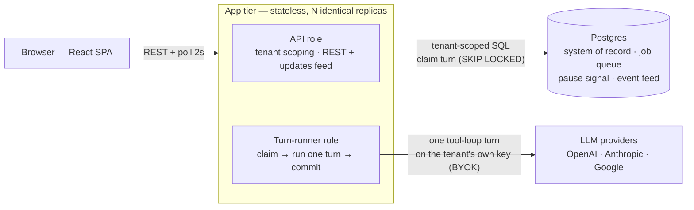
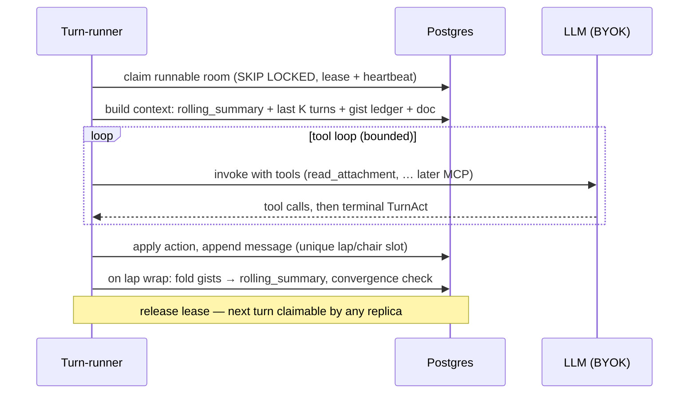

# Conclave architecture

One stateless app tier. One Postgres doing four jobs. A turn is a claimable row.
The shape is identical at canary scale and at 1M users — growth is bigger boxes, more
replicas, and exactly one pre-planned event: a tenant shard split the schema is born
ready for.

## The shape

Every coordination mechanism that a prototype keeps in process memory — task registry,
pause flags, event bus — is a table here. That is the entire horizontal-scaling story:
run more identical processes; `FOR UPDATE SKIP LOCKED` arbitrates.

- **Job queue**: a runnable room is `status='running'` with a free or expired lease
  (`claimed_until`). Workers claim with `SKIP LOCKED`, heartbeat the lease while the
  turn runs (agentic turns can take minutes), and release on commit.
- **Pause signal**: pausing writes `status='paused'`; the claim query stops matching.
  No cancellation protocol.
- **Event feed**: the client polls `GET /conversations/{id}/updates?after=<message_id>`
  every 2s — indistinguishable from push when a message lands every 10+ seconds.
  `LISTEN/NOTIFY` → SSE is the one-function upgrade if poll volume ever shows.
- **Idempotent turns**: unique `(conversation_id, lap, chair_index)`. A dead worker's
  retried turn collides there instead of double-posting.

## One turn

The turn executor is a bounded tool loop terminated by a `TurnAct` call. Tools hang off
a small `ToolProvider` seam ([turn.py](../apps/api/src/conclave/runtime/turn.py)) —
today `read_attachment`; next, per-tenant MCP connectors (read-only allowlists) and a
path-jailed room workspace. The claim/lease shell doesn't care what happens inside a turn.

## Context: constant cost per turn

- **rolling_summary** — a column, folded incrementally at lap boundaries (one line per
  lap), never recomputed.
- **Gist ledger** — every expert self-summarizes its turn in the structured call it
  already makes (`TurnAct.gist`); the ledger rides along in the prompt, tail-capped.
- **Last K turns verbatim** + shared proposal + shared doc.

Token cost per turn is flat no matter how old the room is. Distant recall beyond the
ledger: Postgres FTS first; a pgvector *column* only if recall metrics miss paraphrases;
never a separate vector service for per-room search (a room's corpus is a few hundred rows).

## Convergence

A room converges when: at least 3 completed laps, a full lap of non-forfeit turns all
vote `agree=true`, and their `proposal_hash` fingerprints (sha256 of the normalized
proposal) are identical. Votes live on message rows — no in-memory state.
Safety ceiling: 40 laps → `safety_pause`.

## Day-one invariants (cheap now, brutal to retrofit)

1. `tenant_id` on every table, leading every index — the future shard key.
2. UUIDv7 ids — time-ordered B-tree locality, no cross-shard coordination.
3. Idempotent turns — unique slot + expiring lease with heartbeat.
4. BYOK provider keys Fernet-encrypted at rest (`CONCLAVE_SECRET_KEY`).

## Growth dials (turned by measured numbers, never predicted)

| Stage | What changes | Turned by |
| --- | --- | --- |
| 100 users | Nothing: 1–2 replicas, one small managed Postgres | — |
| 10k | pgbouncer; runners as their own deployment (`CONCLAVE_EMBED_RUNNER=0`, `python -m conclave.runner`) | connection exhaustion; API p99 coupling |
| 100k | read replica; partition messages; archive converged rooms; optional LISTEN/NOTIFY → SSE | read load, table bloat |
| 1M | shard by `tenant_id`; optionally a real queue behind the claim interface | primary write saturation |

Deliberately absent until their trigger metric arrives: Redis, broker/queue service,
vector store, SSE bus, agent frameworks, microservices.
